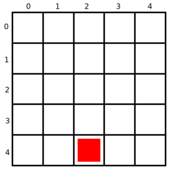
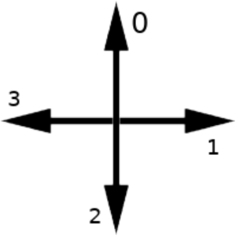

Permalink: /microbit-snake

# Coding Snake on the BBC micro:bit using MicroPython

In this post I'll give a brief introduction to the BBC micro:bit and walk you through an implementation of the classic game Snake on the micro:bit's retro-looking 5x5 display.

## Why Snake?

Snake is a great fit for a "Hello, World" program for the micro:bit, since it can work on the small resolution display and we can make due with the two buttons on the board.  

## Why Python?

There are three main programming languages we can use with the micro:bit:

* **Blocks:**
a visual programming language, primarily targeted at children for educational purposes

* **Javascript:**
a multi-paradigm scripting language, mainly used on the client-side in web applications

* **Python:**
a multi-paradigm scripting language, designed for simplicity and code readibility

I've picked Python, because its syntax most-closely resembles human language and tends to be understandable, regardless of previous programming experience.

Oh, and also... well... Python **is** a snake, isn't it?

# Let's get started!

One of the ways to code our micro:bit would be to write our program in the [recommended text editor](https://python.microbit.org/), press Download and upload the code using the provided micro USB cable to test it.

While this is a great way to start, when we get into more complex programs we may want an easier way to debug our code before compiling and uploading. Thankfully, [Pete Dring](https://github.com/pddring) from [blog.withcode.uk](https://blog.withcode.uk/) has taken the time to create a [browser-based Python IDE](https://create.withcode.uk/) with a micro:bit simulator built-in.

There are only three things we need to do to get set-up:

1. Visit [create.withcode.uk](https://create.withcode.uk/)

2. Type in our import statement for the micro:bit library on the first line:
```python
from microbit import *
```

3. Press the green run button to see our simulator pop-up:


## Our Player

In the game of Snake, the player is represented by a line of pixels, which starts at length 1 and grows over the course of the game. The snake moves in a single direction constantly, until a button is pressed to change it. To represent the snake, we can simply create a list of tuples (points) for each pixel:
```python
snake = [(2, 4)]
```

As you can see, I have initialised the snake at the coordinates of (2, 4). These coordinates will correspond with the coordinate system of the micro:bit itself, which looks like this:



For the **direction**, we can simply express it as a number from 0 to 3:
```python
direction = 0
```

This is chosen arbitrarily, but in my case 0 represents movement in the direction of negative Y, 1 in the direction of positive X, 2 in positive Y and 3 in negative X, like so:



The other value we need to store is the player's **score**, which is also just a simple integer, starting at 1:
```python
score = 1
```

## Food

The point of the game is to collect food and grow the snake. Our "food" will just be another pixel on the board, which starts at (1, 1). After it has been eaten, another piece of food will be randomly assigned coordinates.
```python
food = (1,1)
```

## Time

In my version of the game, when the player collects food, the speed of the snake increases. The way we are going to do this is by introducing a **delay** variable, which will start at 1000 milliseconds:
```python
delay = 1000
```
