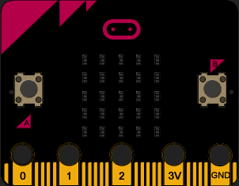

# Coding Snake on the BBC micro:bit using MicroPython

In this post I'll give a brief introduction to the BBC micro:bit and walk you through an implementation of the classic game Snake on the micro:bit's retro-looking 5x5 display.

## Why Snake?

Snake is a great fit for a "Hello, World" program for the micro:bit, since it can work on the small resolution display and we can make due with the two buttons on the board.  

## Why Python?

There are three main programming languages we can use with the micro:bit:

* **Blocks:**
a visual programming language, primarily targeted at children for educational purposes

* **Javascript:**
a multi-paradigm scripting language, mainly used on the client-side in web applications

* **Python:**
a multi-paradigm scripting language, designed for simplicity and code readibility

I've picked Python, because its syntax most-closely resembles human language and tends to be understandable, regardless of previous programming experience.

Oh, and also... well... Python **is** a snake, isn't it?

# Let's get started!

One of the ways to code our micro:bit would be to write our program in the [recommended text editor](https://python.microbit.org/), press Download and upload the code using the provided micro USB cable to test it.

While this is a great way to start, when we get into more complex programs we may want an easier way to debug our code before compiling and uploading. Thankfully, [Pete Dring](https://github.com/pddring) from [blog.withcode.uk](https://blog.withcode.uk/) has taken the time to create a [browser-based Python IDE](https://create.withcode.uk/) with a micro:bit simulator built-in.

There are only three things we need to do to get set-up:

1. Visit [create.withcode.uk](https://create.withcode.uk/)

2. Type in our import statement for the micro:bit library on the first line:
```Python
from microbit import *
```

3. Press the green run button to see our simulator pop-up:

<br>

